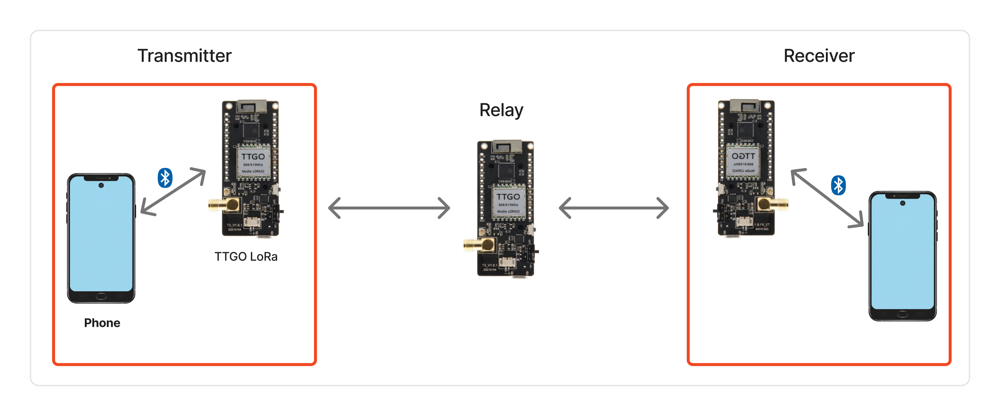
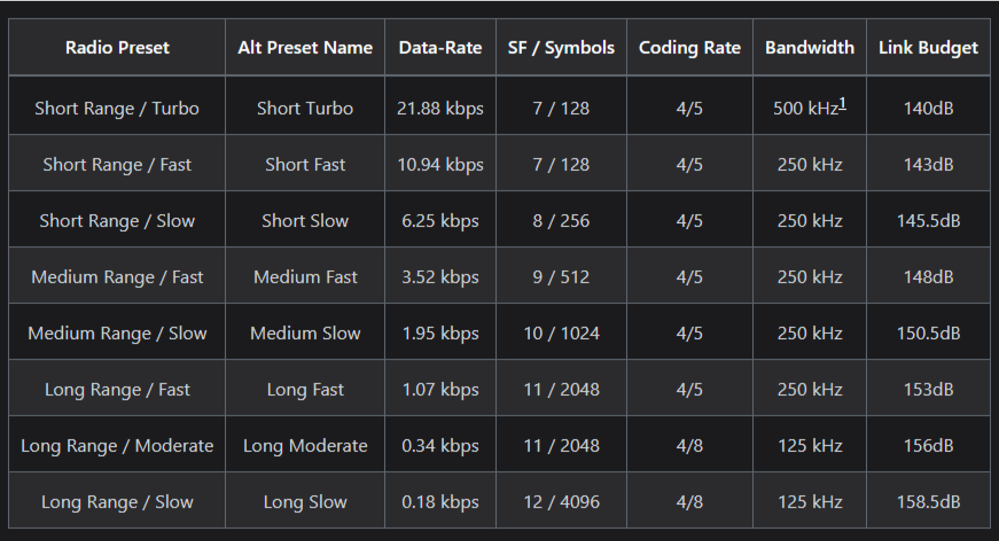

# 📡 Rancang Bangun Sistem Komunikasi Alternatif Pada Lingkungan Off-Grid Berbasis Multi-Hop dengan LoRa

> Mata Kuliah: **Riset Informatika**  
> Pengampu: **Dr. Basuki Rahmat, S.Si. MT. (NIP 19690723 202121 1 002)**  
> oleh: **Iqbal Al-Ayyubi (NPM 22081010217)**  
> UPN Veteran Jawa Timur, 2025

---

## 📝 Latar Belakang

Pada era digital, komunikasi merupakan kebutuhan mendasar manusia. Namun, infrastruktur jaringan seperti listrik dan internet tidak selalu tersedia di semua wilayah, terutama pada daerah terpencil atau saat bencana alam. Data Asosiasi Penyelenggara Jasa Internet
Indonesia (APJII) 2025 menunjukkan bahwa **sekitar 19,34% populasi Indonesia (±55 juta jiwa)** belum menikmati akses internet.

Teknologi komunikasi lokal seperti Wi-Fi dan Bluetooth memiliki keterbatasan pada jangkauan dan konsumsi daya. **LoRa (Long Range)** hadir sebagai solusi alternatif dengan jangkauan luas, konsumsi daya rendah, dan tidak membutuhkan infrastruktur internet. Dengan memanfaatkan **komunikasi multi-hop**, jangkauan sistem dapat diperluas melalui node perantara, memungkinkan pengiriman pesan di wilayah off-grid.

---

## ❓ Rumusan Masalah

1. Bagaimana merancang sistem komunikasi pesan berbasis LoRa yang dapat
   beroperasi pada lingkungan tanpa jaringan internet (off-grid) ?
2. Bagaimana hasil performa sistem komunikasi pesan multi-hop berbasis
   LoRa, ditinjau dari **Packet Delivery Ratio (PDR)**, **latency**, dan **jangkauan komunikasi** pada kondisi uji indoor maupun outdoor ?

---

## 🎯 Tujuan Penelitian

1. Merancang dan mengimplementasikan sistem komunikasi pesan berbasis LoRa yang mampu beroperasi pada lingkungan off-grid menggunakan perangkat TTGO LoRa32 dengan firmware Meshtastic.
2. Menganalisis pengaruh konfigurasi parameter LoRa pada firmware Meshtastic terhadap performa komunikasi multi-hop.
3. Mengevaluasi kinerja sistem komunikasi pesan multi-hop berbasis LoRa berdasarkan parameter Packet Delivery Ratio (PDR), latency, dan jangkauan komunikasi melalui pengujian pada kondisi indoor maupun outdoor.

---

## 🌟 Manfaat Penelitian

- Mengevaluasi kinerja sistem komunikasi pesan multi-hop berbasis LoRa berdasarkan parameter Packet Delivery Ratio (PDR), latency, dan jangkauan komunikasi melalui pengujian pada kondisi indoor maupun outdoor.
- Memberikan referensi teknis bagi pengembang sistem IoT dan komunikasi lokal yang hemat daya dan mudah diimplementasikan.
- Memberikan keandalan untuk pengiriman pesan dengan jangkauan yang lebih luas.

---

## 📌 Batasan Masalah

- Sistem komunikasi yang dirancang hanya mendukung **pengiriman pesan** teks antar pengguna
- Perangkat keras yang digunakan sudah terintegrasi dengan **ESP32** dan
  modul **LoRa (TTGO LoRa32)**.
- Sistem komunikasi beroperasi dalam **jaringan lokal** dengan konsep multi-hop tanpa infrastruktur **jaringan internet** atau **seluler**.
- Pengujian dilakukan dengan menggunakan tiga modul **TTGO LoRa32** untuk merepresentasikan skenario komunikasi **multi-hop** antar perangkat.

---

## 🧠 Tinjauan Pustaka (Ringkasan)

| Topik                   | Ringkasan                                                                                          |
| ----------------------- | -------------------------------------------------------------------------------------------------- |
| **Teknologi Nirkabel**  | LoRa unggul dalam jangkauan & efisiensi daya dibanding Wi-Fi & Bluetooth.                          |
| **LoRa**                | Teknologi spread spectrum (CSS) dengan SF7–SF12, bandwidth 125–500 kHz, sangat tahan interferensi. |
| **ESP32**               | Mikrokontroler hemat daya dengan Wi-Fi & Bluetooth terintegrasi, cocok untuk aplikasi IoT.         |
| **TTGO LoRa32**         | Papan ESP32 + SX1276 + OLED, mendukung komunikasi jarak jauh & fleksibel.                          |
| **Arsitektur Jaringan** | Menggunakan **P2P** & **multi-hop** untuk memperluas jangkauan antar node.                         |
| **Meshtastic**          | Firmware open-source LoRa mesh yang memungkinkan komunikasi desentralisasi multi-hop.              |

---

## 🧪 Desain & Metodologi Penelitian

### Jenis Penelitian

- **Implementatif – Research and Development (R&D)** dengan pendekatan **Waterfall**.

### Lokasi & Waktu

- **Indoor**: Asrama Mahasiswa Nusantara, Surabaya.
- **Outdoor**: Jl. Raya Kedung Baruk.
- Durasi ± 10 bulan.

### Subjek Penelitian

- 3 modul TTGO LoRa32, firmware Meshtastic, aplikasi mobile Android.

### Tahapan Penelitian

1. **Identifikasi Masalah** – keterbatasan komunikasi di wilayah off-grid.
2. **Pengumpulan Informasi** – studi literatur & kebutuhan sistem.
3. **Perancangan** – arsitektur sistem 3-node multi-hop.
4. **Implementasi** – konfigurasi firmware Meshtastic & aplikasi mobile.
5. **Kalibrasi** – pengaturan frekuensi, SF, bandwidth, coding rate secara iteratif.

### Rancangan Pengujian

### Radio Preset Meshtastic

